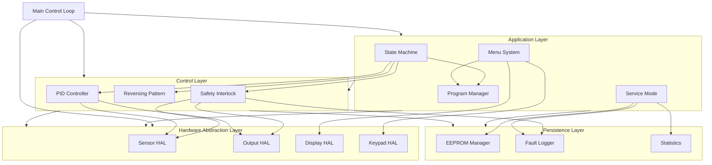
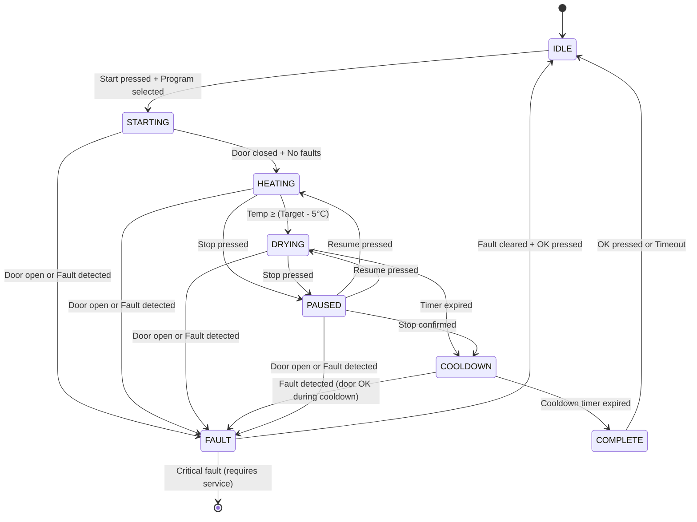

# Design Document: IMESA ES Series Industrial Tumble Dryer Controller

## Overview

This design document specifies the software architecture for an Arduino Nano-based industrial tumble dryer controller that replicates the behavior of the IMESA ES Series Industrial Tumble Dryer. The controller implements safety-critical machine control with closed-loop temperature regulation, drum motor control with reversing patterns, menu-driven HMI, and industrial-grade fault handling.

### Design Goals

1. **Safety-First Architecture**: All safety interlocks implemented in software with <100ms response time
2. **Deterministic Real-Time Behavior**: Predictable timing for control loops and safety responses
3. **Modular Design**: Clear separation of concerns for maintainability and testing
4. **Resource Efficiency**: Fit within Arduino Nano constraints (32KB flash, 2KB SRAM, 1KB EEPROM)
5. **Industrial Reliability**: Robust fault handling, watchdog protection, and graceful degradation
6. **IMESA Compatibility**: Replicate IMESA ES Series user experience where documented

### System Context

The controller interfaces with:

- **Sensors**: DS18B20 temperature sensor, door safety switch
- **Actuators**: Heater relay, motor forward relay, motor reverse relay
- **HMI**: 20x4 I2C LCD display, 4x4 matrix keypad
- **Storage**: Internal EEPROM for configuration and logs

### Key Design Decisions

1. **State Machine Architecture**: Cycle execution implemented as explicit finite state machine for predictability
2. **Hardware Abstraction Layer**: All I/O through abstraction layer to enable testing and portability
3. **Non-Blocking I/O**: All sensor reads and display updates use non-blocking patterns
4. **Static Memory Allocation**: No dynamic allocation to prevent fragmentation and ensure deterministic behavior
5. **PROGMEM for Constants**: All constant data stored in flash to conserve SRAM
6. **Cooperative Multitasking**: Time-sliced execution without RTOS overhead

## Architecture

### High-Level Architecture

The system follows a layered architecture:

```
┌─────────────────────────────────────────────────────────┐
│                   Application Layer                      │
│  ┌──────────────┐  ┌──────────────┐  ┌──────────────┐  │
│  │ Cycle State  │  │ Menu System  │  │ Service Mode │  │
│  │   Machine    │  │              │  │              │  │
│  └──────────────┘  └──────────────┘  └──────────────┘  │
└─────────────────────────────────────────────────────────┘
┌─────────────────────────────────────────────────────────┐
│                   Control Layer                          │
│  ┌──────────────┐  ┌──────────────┐  ┌──────────────┐  │
│  │ PID          │  │ Reversing    │  │ Safety       │  │
│  │ Controller   │  │ Pattern      │  │ Interlock    │  │
│  └──────────────┘  └──────────────┘  └──────────────┘  │
└─────────────────────────────────────────────────────────┘
┌─────────────────────────────────────────────────────────┐
│              Hardware Abstraction Layer                  │
│  ┌──────────────┐  ┌──────────────┐  ┌──────────────┐  │
│  │ Sensor HAL   │  │ Output HAL   │  │ HMI HAL      │  │
│  └──────────────┘  └──────────────┘  └──────────────┘  │
└─────────────────────────────────────────────────────────┘
┌─────────────────────────────────────────────────────────┐
│                   Hardware Layer                         │
│  DS18B20 │ Door Sensor │ Relays │ LCD │ Keypad │ EEPROM │
└─────────────────────────────────────────────────────────┘
```

### Module Decomposition

The firmware is organized into the following modules:

#### 1. Main Control Loop (`main.cpp`)

- System initialization
- Main control loop execution (100ms cycle time)
- Watchdog management
- Module coordination

#### 2. Hardware Abstraction Layer (`hal/`)

- `sensor_hal.h/cpp`: Temperature sensor and door sensor interface
- `output_hal.h/cpp`: Relay control with safety interlocks
- `display_hal.h/cpp`: LCD display interface
- `keypad_hal.h/cpp`: Keypad scanning and debouncing

#### 3. Control Layer (`control/`)

- `pid_controller.h/cpp`: PID temperature control implementation
- `reversing_pattern.h/cpp`: Drum direction control
- `safety_interlock.h/cpp`: Safety condition monitoring and enforcement

#### 4. Application Layer (`app/`)

- `state_machine.h/cpp`: Cycle execution state machine
- `menu_system.h/cpp`: Menu navigation and display
- `service_mode.h/cpp`: Diagnostic and configuration functions
- `program_manager.h/cpp`: Program definition and parameter management

#### 5. Persistence Layer (`storage/`)

- `eeprom_manager.h/cpp`: EEPROM read/write with checksums
- `fault_logger.h/cpp`: Fault event logging
- `statistics.h/cpp`: Usage tracking

#### 6. Utilities (`util/`)

- `timing.h/cpp`: Non-blocking timing utilities
- `filter.h/cpp`: Signal filtering (moving average)
- `types.h`: Common type definitions and enumerations

### Execution Model

The system uses a cooperative multitasking model with time-sliced execution:

```
Main Loop (100ms cycle):
├─ Read Inputs (sensors, keypad)
├─ Update Safety Interlocks
├─ Execute State Machine
├─ Update Control Algorithms (PID, reversing)
├─ Write Outputs (relays)
├─ Update Display (every 5th cycle = 500ms)
├─ Reset Watchdog
└─ Sleep until next cycle
```

### Timing Budget

| Task                     | Frequency | Max Duration | Priority |
| ------------------------ | --------- | ------------ | -------- |
| Door sensor read         | 100ms     | 1ms          | Critical |
| Safety interlock check   | 100ms     | 2ms          | Critical |
| Relay output update      | 100ms     | 1ms          | Critical |
| Temperature read         | 1000ms    | 50ms         | High     |
| PID calculation          | 1000ms    | 5ms          | High     |
| Reversing pattern update | 100ms     | 2ms          | High     |
| State machine update     | 100ms     | 5ms          | Medium   |
| Keypad scan              | 100ms     | 5ms          | Medium   |
| Display update           | 500ms     | 20ms         | Low      |
| EEPROM write             | On-demand | 100ms        | Low      |

Total critical path: ~15ms per 100ms cycle (15% utilization)

## Components and Interfaces

### Component Diagram



### Key Interfaces

#### ISensorHAL

```cpp
class ISensorHAL {
public:
    virtual bool readDoorSensor() = 0;  // true = closed, false = open
    virtual float readTemperature() = 0;  // Returns °C, NAN if invalid
    virtual bool isTemperatureSensorValid() = 0;
    virtual void update() = 0;  // Non-blocking update, call every loop
};
```

#### IOutputHAL

```cpp
class IOutputHAL {
public:
    virtual void setHeater(bool enable) = 0;
    virtual void setMotorForward(bool enable) = 0;
    virtual void setMotorReverse(bool enable) = 0;
    virtual void emergencyStop() = 0;  // All outputs off immediately
    virtual bool getHeaterState() = 0;
    virtual bool getMotorForwardState() = 0;
    virtual bool getMotorReverseState() = 0;
};
```

#### IDisplayHAL

```cpp
class IDisplayHAL {
public:
    virtual void init() = 0;
    virtual void clear() = 0;
    virtual void setCursor(uint8_t col, uint8_t row) = 0;
    virtual void print(const char* text) = 0;
    virtual void print(const __FlashStringHelper* text) = 0;  // PROGMEM strings
    virtual void setBacklight(bool enable) = 0;
};
```

#### IKeypadHAL

```cpp
enum class Key {
    NONE, UP, DOWN, LEFT, RIGHT, OK, START, STOP, CANCEL,
    NUM_0, NUM_1, NUM_2, NUM_3, NUM_4, NUM_5, NUM_6, NUM_7, NUM_8, NUM_9
};

class IKeypadHAL {
public:
    virtual Key getKey() = 0;  // Returns NONE if no key pressed
    virtual void update() = 0;  // Non-blocking scan, call every loop
};
```

#### IPIDController

```cpp
struct PIDParams {
    float kp;
    float ki;
    float kd;
    float outputMin;
    float outputMax;
};

class IPIDController {
public:
    virtual void setSetpoint(float setpoint) = 0;
    virtual void setParams(const PIDParams& params) = 0;
    virtual float compute(float input, uint32_t dt) = 0;  // Returns control output
    virtual void reset() = 0;
    virtual float getOutput() = 0;
};
```

#### ISafetyInterlock

```cpp
enum class FaultCode {
    NONE,
    DOOR_OPEN,
    TEMP_SENSOR_FAIL,
    OVER_TEMPERATURE,
    LCD_FAIL,
    RELAY_CONFLICT,
    WATCHDOG_RESET
};

class ISafetyInterlock {
public:
    virtual void update() = 0;  // Check all safety conditions
    virtual bool isSafe() = 0;  // true if all conditions OK
    virtual FaultCode getFaultCode() = 0;
    virtual void clearFault() = 0;
    virtual bool canActivateHeater() = 0;
    virtual bool canActivateMotor() = 0;
};
```

#### IStateMachine

```cpp
enum class CycleState {
    IDLE,
    STARTING,
    HEATING,
    DRYING,
    COOLDOWN,
    COMPLETE,
    PAUSED,
    FAULT
};

class IStateMachine {
public:
    virtual void start(uint8_t programId) = 0;
    virtual void stop() = 0;
    virtual void pause() = 0;
    virtual void resume() = 0;
    virtual void update() = 0;
    virtual CycleState getState() = 0;
    virtual uint32_t getRemainingTime() = 0;  // seconds
};
```

### Data Flow

#### Temperature Control Loop

```
DS18B20 Sensor → SensorHAL (filtering) → PID Controller → OutputHAL → Heater Relay
                                              ↑
                                         Setpoint from
                                         Active Program
```

#### Safety Interlock Flow

```
Door Sensor ──┐
              ├→ SafetyInterlock → OutputHAL (enable/disable)
Temp Sensor ──┤                  ↓
              │              FaultLogger
Relay States ─┘
```

#### User Input Flow

```
Keypad → KeypadHAL (debounce) → MenuSystem → DisplayHAL → LCD
                                     ↓
                                StateMachine
                                     ↓
                              ProgramManager
```

## Data Models

### Program Definition

```cpp
struct Program {
    char name[17];              // 16 chars + null terminator
    uint8_t targetTemp;         // °C
    uint16_t duration;          // minutes
    uint8_t forwardTime;        // seconds
    uint8_t reverseTime;        // seconds
    uint8_t pauseTime;          // seconds
    uint8_t cooldownDuration;   // minutes
    uint8_t checksum;           // CRC8 of above fields
};
```

Programs are stored in PROGMEM as default values and can be overridden in EEPROM:

```cpp
const Program DEFAULT_PROGRAMS[6] PROGMEM = {
    {"Towels",       75, 45, 30, 30, 2, 10, 0},
    {"Bed Sheets",   70, 50, 40, 20, 2, 10, 0},
    {"Mixed Load",   65, 40, 35, 25, 2,  8, 0},
    {"Heavy Cotton", 80, 60, 45, 15, 2, 12, 0},
    {"Delicate",     50, 30, 20, 40, 3,  8, 0},
    {"Work Wear",    75, 55, 35, 25, 2, 10, 0}
};
```

### Cycle State Data

```cpp
struct CycleData {
    CycleState state;
    uint8_t programId;
    uint32_t startTime;         // millis() at cycle start
    uint32_t elapsedTime;       // seconds
    uint32_t remainingTime;     // seconds
    float currentTemp;
    float targetTemp;
    bool heaterActive;
    bool motorActive;
    uint8_t motorDirection;     // 0=stopped, 1=forward, 2=reverse
};
```

### Fault Log Entry

```cpp
struct FaultEntry {
    FaultCode code;
    uint32_t timestamp;         // seconds since boot (or RTC if available)
    CycleState stateAtFault;
    float temperatureAtFault;
    uint8_t checksum;
};
```

Fault log stored as circular buffer in EEPROM:

```cpp
struct FaultLog {
    uint8_t count;              // Number of entries (max 20)
    uint8_t writeIndex;         // Next write position
    FaultEntry entries[20];
    uint16_t checksum;          // CRC16 of entire structure
};
```

### PID State

```cpp
struct PIDState {
    float setpoint;
    float lastInput;
    float integral;
    float lastError;
    float output;
    uint32_t lastTime;
    PIDParams params;
};
```

### Reversing Pattern State

```cpp
struct ReversingState {
    uint8_t forwardTime;        // seconds
    uint8_t reverseTime;        // seconds
    uint8_t pauseTime;          // seconds
    uint32_t phaseStartTime;    // millis()
    enum Phase {
        FORWARD,
        PAUSE_AFTER_FORWARD,
        REVERSE,
        PAUSE_AFTER_REVERSE
    } currentPhase;
};
```

### EEPROM Memory Map

```
Address Range | Size  | Content
--------------|-------|----------------------------------
0x0000-0x0003 | 4     | Magic number (0xDEADBEEF)
0x0004-0x0005 | 2     | Format version
0x0006-0x0007 | 2     | CRC16 of header
0x0008-0x000B | 4     | Service code
0x000C-0x001F | 20    | PID parameters + checksum
0x0020-0x00FF | 224   | Program overrides (6 × 37 bytes)
0x0100-0x01FF | 256   | Fault log
0x0200-0x023F | 64    | Statistics
0x0240-0x03FF | 448   | Reserved for future use
```

### Statistics Data

```cpp
struct Statistics {
    uint32_t totalCycles;
    uint32_t totalOperatingHours;
    uint32_t heaterHours;
    uint32_t motorHours;
    uint16_t cyclesPerProgram[6];
    uint8_t watchdogResetCount;
    uint32_t relayActivationCount[3];  // heater, motor_fwd, motor_rev
    uint16_t checksum;
};
```

### Menu State

```cpp
enum class MenuContext {
    MAIN_MENU,
    AUTO_MODE,
    MANUAL_MODE,
    PROGRAM_SELECT,
    SERVICE_MENU,
    DIAGNOSTICS,
    PARAMETER_EDIT
};

struct MenuState {
    MenuContext context;
    uint8_t selectedIndex;
    uint8_t scrollOffset;
    uint32_t lastActivityTime;  // For timeout
    bool editMode;
    int16_t editValue;
};
```

### Display Buffer

To minimize I2C traffic, maintain a shadow buffer:

```cpp
struct DisplayBuffer {
    char lines[4][21];          // 4 lines × 20 chars + null
    bool dirty[4];              // Track which lines need update
    uint32_t lastUpdate;
};
```

### Filter State

For temperature sensor filtering:

```cpp
template<typename T, uint8_t N>
struct MovingAverage {
    T samples[N];
    uint8_t index;
    uint8_t count;
    T sum;
};
```

### Safety Interlock State

```cpp
struct SafetyState {
    bool doorClosed;
    bool tempSensorValid;
    bool tempInRange;
    bool noRelayConflict;
    FaultCode activeFault;
    uint32_t faultTime;
    bool faultAcknowledged;
};
```

## State Machine Design

### Cycle State Machine

The cycle execution follows a deterministic finite state machine:



### State Behaviors

#### IDLE State

- **Entry**: Clear cycle data, display ready screen
- **Active**: Monitor keypad for menu navigation or start command
- **Exit**: Load selected program parameters

#### STARTING State

- **Entry**: Validate safety conditions, display "STARTING"
- **Active**: Perform pre-start checks (door, sensor, no faults)
- **Exit**: Initialize cycle timers and control algorithms
- **Timeout**: 5 seconds → return to IDLE if conditions not met

#### HEATING State

- **Entry**: Activate PID controller, start reversing pattern
- **Active**:
  - PID controls heater to reach target temperature
  - Drum rotates with reversing pattern
  - Display shows "HEATING" and current/target temp
- **Exit**: None
- **Transition**: When temp ≥ (target - 5°C) for 30 seconds

#### DRYING State

- **Entry**: Start main cycle timer
- **Active**:
  - PID maintains target temperature
  - Drum continues reversing pattern
  - Display shows "DRYING", time remaining, temp
  - Decrement timer each second
- **Exit**: None
- **Transition**: When timer reaches zero

#### COOLDOWN State

- **Entry**: Deactivate heater, start cooldown timer
- **Active**:
  - Heater OFF
  - Drum continues reversing pattern
  - Display shows "COOLDOWN" and time remaining
- **Exit**: Stop drum motor
- **Transition**: When cooldown timer reaches zero

#### COMPLETE State

- **Entry**: Display "CYCLE COMPLETE", sound buzzer (if available)
- **Active**: Wait for user acknowledgment
- **Exit**: Clear cycle data
- **Timeout**: 60 seconds → auto-return to IDLE

#### PAUSED State

- **Entry**: Deactivate all outputs, save cycle state
- **Active**: Display "PAUSED" with resume/stop options
- **Exit**: Restore outputs if resuming
- **Timeout**: 5 minutes → auto-stop and enter COOLDOWN

#### FAULT State

- **Entry**: Emergency stop all outputs, log fault
- **Active**: Display fault code and message, flash display
- **Exit**: Clear fault flag if non-critical
- **Transition**: Requires user acknowledgment or service mode

### State Transition Guards

All state transitions are guarded by safety conditions:

```cpp
bool canTransition(CycleState from, CycleState to) {
    // Always allow transition to FAULT
    if (to == CycleState::FAULT) return true;

    // Check safety interlocks for active states
    if (to == CycleState::HEATING || to == CycleState::DRYING) {
        if (!safetyInterlock.isSafe()) return false;
        if (!safetyInterlock.canActivateHeater()) return false;
        if (!safetyInterlock.canActivateMotor()) return false;
    }

    // Check door for states requiring closed door
    if (to == CycleState::STARTING || to == CycleState::HEATING ||
        to == CycleState::DRYING) {
        if (!sensorHAL.readDoorSensor()) return false;
    }

    return true;
}
```

## Control Algorithms

### PID Temperature Control

#### Algorithm Selection

Standard PID control with anti-windup is appropriate for this application because:

- Industrial dryer thermal dynamics are well-modeled by first-order lag
- PID provides good disturbance rejection (door opening, load variations)
- Derivative term helps prevent overshoot with high thermal mass
- Well-understood tuning methods available

#### PID Implementation

```cpp
float PIDController::compute(float input, uint32_t dt) {
    float error = setpoint - input;

    // Proportional term
    float pTerm = params.kp * error;

    // Integral term with anti-windup
    integral += error * (dt / 1000.0);

    // Clamp integral to prevent windup
    float integralMax = (params.outputMax - params.outputMin) / params.ki;
    if (integral > integralMax) integral = integralMax;
    if (integral < -integralMax) integral = -integralMax;

    float iTerm = params.ki * integral;

    // Derivative term (on measurement to avoid setpoint kick)
    float derivative = (lastInput - input) / (dt / 1000.0);
    float dTerm = params.kd * derivative;

    // Compute output
    output = pTerm + iTerm + dTerm;

    // Clamp output
    if (output > params.outputMax) output = params.outputMax;
    if (output < params.outputMin) output = params.outputMin;

    // Save state
    lastInput = input;
    lastError = error;

    return output;
}
```

#### Relay Control from PID Output

Since we have on/off relay control, convert PID output to relay state:

```cpp
void updateHeaterFromPID(float pidOutput) {
    // Hysteresis to prevent chatter
    static const float UPPER_THRESHOLD = 50.0;
    static const float LOWER_THRESHOLD = 45.0;

    bool currentState = outputHAL.getHeaterState();

    if (!currentState && pidOutput > UPPER_THRESHOLD) {
        // Turn on if output high and currently off
        if (safetyInterlock.canActivateHeater()) {
            outputHAL.setHeater(true);
        }
    } else if (currentState && pidOutput < LOWER_THRESHOLD) {
        // Turn off if output low and currently on
        outputHAL.setHeater(false);
    }
    // Otherwise maintain current state (hysteresis band)
}
```

#### Auto-Tune Algorithm

Implement Relay Feedback Test (Åström-Hägglund method):

```cpp
// Auto-tune state machine
enum class AutoTuneState {
    IDLE,
    WAITING_FOR_STEADY_STATE,
    RELAY_TEST,
    CALCULATING,
    COMPLETE,
    FAILED
};

// Relay test: oscillate heater and measure response
void autoTuneUpdate() {
    switch (autoTuneState) {
        case WAITING_FOR_STEADY_STATE:
            // Wait for temperature to stabilize
            if (isTemperatureStable()) {
                autoTuneState = RELAY_TEST;
                relayTestStartTime = millis();
            }
            break;

        case RELAY_TEST:
            // Apply relay feedback
            float temp = sensorHAL.readTemperature();

            if (temp < targetTemp) {
                outputHAL.setHeater(true);
            } else {
                outputHAL.setHeater(false);
            }

            // Record peaks and valleys
            detectPeaksAndValleys(temp);

            // After 3-4 oscillations, calculate parameters
            if (oscillationCount >= 3) {
                calculatePIDParams();
                autoTuneState = CALCULATING;
            }

            // Timeout after 30 minutes
            if (millis() - relayTestStartTime > 1800000) {
                autoTuneState = FAILED;
            }
            break;

        case CALCULATING:
            // Use Ziegler-Nichols tuning rules
            float Ku = 4.0 * relayAmplitude / (PI * oscillationAmplitude);
            float Tu = averageOscillationPeriod;

            // Classic PID tuning
            params.kp = 0.6 * Ku;
            params.ki = 1.2 * Ku / Tu;
            params.kd = 0.075 * Ku * Tu;

            autoTuneState = COMPLETE;
            break;
    }
}
```

### Drum Reversing Pattern Control

#### Pattern Execution

```cpp
void ReversingPattern::update() {
    uint32_t elapsed = millis() - phaseStartTime;
    uint32_t phaseTime = 0;
    Phase nextPhase = currentPhase;

    switch (currentPhase) {
        case FORWARD:
            phaseTime = forwardTime * 1000;
            if (elapsed >= phaseTime) {
                outputHAL.setMotorForward(false);
                nextPhase = PAUSE_AFTER_FORWARD;
                phaseStartTime = millis();
            }
            break;

        case PAUSE_AFTER_FORWARD:
            phaseTime = max(pauseTime, 2) * 1000;  // Minimum 2 seconds
            if (elapsed >= phaseTime) {
                if (safetyInterlock.canActivateMotor()) {
                    outputHAL.setMotorReverse(true);
                    nextPhase = REVERSE;
                    phaseStartTime = millis();
                }
            }
            break;

        case REVERSE:
            phaseTime = reverseTime * 1000;
            if (elapsed >= phaseTime) {
                outputHAL.setMotorReverse(false);
                nextPhase = PAUSE_AFTER_REVERSE;
                phaseStartTime = millis();
            }
            break;

        case PAUSE_AFTER_REVERSE:
            phaseTime = max(pauseTime, 2) * 1000;  // Minimum 2 seconds
            if (elapsed >= phaseTime) {
                if (safetyInterlock.canActivateMotor()) {
                    outputHAL.setMotorForward(true);
                    nextPhase = FORWARD;
                    phaseStartTime = millis();
                }
            }
            break;
    }

    currentPhase = nextPhase;
}
```

### Safety Interlock Logic

#### Continuous Safety Monitoring

```cpp
void SafetyInterlock::update() {
    // Read all safety-critical inputs
    bool doorNowClosed = sensorHAL.readDoorSensor();
    bool tempValid = sensorHAL.isTemperatureSensorValid();
    float temp = sensorHAL.readTemperature();

    // Check for door open
    if (!doorNowClosed && doorClosed) {
        // Door just opened
        triggerFault(FaultCode::DOOR_OPEN);
    }
    doorClosed = doorNowClosed;

    // Check temperature sensor
    if (!tempValid) {
        tempSensorFailCount++;
        if (tempSensorFailCount >= 3) {
            triggerFault(FaultCode::TEMP_SENSOR_FAIL);
        }
    } else {
        tempSensorFailCount = 0;
    }

    // Check over-temperature
    if (tempValid && temp > 100.0) {
        triggerFault(FaultCode::OVER_TEMPERATURE);
    }

    // Check relay conflict
    if (outputHAL.getMotorForwardState() && outputHAL.getMotorReverseState()) {
        triggerFault(FaultCode::RELAY_CONFLICT);
    }

    // Update safe state
    tempSensorValid = tempValid;
    tempInRange = (temp >= -10.0 && temp <= 100.0);
    noRelayConflict = !(outputHAL.getMotorForwardState() &&
                        outputHAL.getMotorReverseState());
}

void SafetyInterlock::triggerFault(FaultCode code) {
    activeFault = code;
    faultTime = millis();
    faultAcknowledged = false;

    // Emergency stop all outputs
    outputHAL.emergencyStop();

    // Log fault
    faultLogger.logFault(code, stateMachine.getState(),
                         sensorHAL.readTemperature());
}

bool SafetyInterlock::isSafe() {
    return activeFault == FaultCode::NONE &&
           doorClosed &&
           tempSensorValid &&
           tempInRange &&
           noRelayConflict;
}

bool SafetyInterlock::canActivateHeater() {
    return isSafe() &&
           sensorHAL.readTemperature() < 100.0;
}

bool SafetyInterlock::canActivateMotor() {
    return doorClosed &&
           activeFault == FaultCode::NONE;
}
```

### Temperature Sensor Filtering

```cpp
class TemperatureSensorFilter {
private:
    MovingAverage<float, 5> filter;
    float lastValidReading;
    uint8_t invalidCount;

public:
    float update(float rawReading) {
        // Reject obviously invalid readings
        if (isnan(rawReading) || rawReading < -10.0 || rawReading > 150.0) {
            invalidCount++;
            return lastValidReading;
        }

        // Add to moving average
        filter.add(rawReading);
        invalidCount = 0;

        // Get filtered value
        float filtered = filter.getAverage();
        lastValidReading = filtered;

        return filtered;
    }

    bool isValid() {
        return invalidCount < 3 && filter.count >= 3;
    }
};
```

## HMI Design

### Menu Structure

```
Main Menu
├── Auto Mode
│   ├── Select Program
│   │   ├── Towels
│   │   ├── Bed Sheets
│   │   ├── Mixed Load
│   │   ├── Heavy Cotton
│   │   ├── Delicate
│   │   └── Work Wear
│   └── [Start Cycle]
├── Manual Mode
│   ├── Set Temperature
│   ├── Set Timer
│   ├── Heater Control
│   └── Motor Control
├── View Status
│   ├── Current Temperature
│   ├── Cycle Statistics
│   └── Last Cycle Info
└── Service Mode (code required)
    ├── Program Edit
    ├── PID Parameters
    ├── Auto-Tune
    ├── Diagnostics
    │   ├── Test Heater
    │   ├── Test Motor Fwd
    │   ├── Test Motor Rev
    │   ├── Test Door Sensor
    │   └── Test Temp Sensor
    ├── Fault Log
    ├── Statistics
    └── Factory Reset
```

### Display Layouts

#### Idle Screen

```
┌────────────────────┐
│ IMESA DRYER READY  │
│ Temp: 25°C         │
│ Last: Towels       │
│ Press OK for Menu  │
└────────────────────┘
```

#### Cycle Running Screen

```
┌────────────────────┐
│ DRYING: Towels     │
│ 68°C → 75°C        │
│ Time: 32:15        │
│ [████████░░] 80%   │
└────────────────────┘
```

#### Fault Screen (flashing)

```
┌────────────────────┐
│ *** FAULT ***      │
│ DOOR OPEN          │
│ Event: 00042       │
│ Press OK to clear  │
└────────────────────┘
```

#### Menu Navigation Screen

```
┌────────────────────┐
│ Main Menu          │
│ > Auto Mode        │
│   Manual Mode      │
│ ↑↓:Nav OK:Select   │
└────────────────────┘
```

#### Parameter Edit Screen

```
┌────────────────────┐
│ Edit: Temperature  │
│                    │
│ Value: 75 °C       │
│ ↑↓:Change OK:Save  │
└────────────────────┘
```

### Navigation Logic

```cpp
void MenuSystem::handleKey(Key key) {
    switch (key) {
        case Key::UP:
            if (selectedIndex > 0) {
                selectedIndex--;
                updateDisplay();
            }
            break;

        case Key::DOWN:
            if (selectedIndex < menuItemCount - 1) {
                selectedIndex++;
                updateDisplay();
            }
            break;

        case Key::OK:
            enterSelectedItem();
            break;

        case Key::CANCEL:
            exitCurrentMenu();
            break;

        case Key::START:
            if (canStartCycle()) {
                stateMachine.start(selectedProgramId);
            }
            break;

        case Key::STOP:
            if (stateMachine.getState() != CycleState::IDLE) {
                stateMachine.stop();
            }
            break;
    }

    lastActivityTime = millis();
}
```

### Display Update Strategy

To minimize I2C traffic and improve responsiveness:

```cpp
void DisplayHAL::updateLine(uint8_t line, const char* text) {
    // Only update if content changed
    if (strcmp(displayBuffer.lines[line], text) == 0) {
        return;
    }

    // Update buffer
    strncpy(displayBuffer.lines[line], text, 20);
    displayBuffer.lines[line][20] = '\0';
    displayBuffer.dirty[line] = true;
}

void DisplayHAL::flush() {
    for (uint8_t i = 0; i < 4; i++) {
        if (displayBuffer.dirty[i]) {
            lcd.setCursor(0, i);
            lcd.print(displayBuffer.lines[i]);
            displayBuffer.dirty[i] = false;
        }
    }
    displayBuffer.lastUpdate = millis();
}
```

## Hardware Abstraction Layer

### Sensor HAL Implementation

```cpp
class SensorHAL : public ISensorHAL {
private:
    OneWire oneWire;
    DallasTemperature tempSensor;
    TemperatureSensorFilter filter;
    uint8_t doorPin;
    uint32_t lastTempRequest;
    bool tempRequestPending;

public:
    SensorHAL(uint8_t tempPin, uint8_t doorPin)
        : oneWire(tempPin), tempSensor(&oneWire), doorPin(doorPin) {
        pinMode(doorPin, INPUT_PULLUP);
    }

    void update() override {
        // Non-blocking temperature read
        if (!tempRequestPending) {
            tempSensor.requestTemperatures();
            tempRequestPending = true;
            lastTempRequest = millis();
        } else if (millis() - lastTempRequest > 750) {
            // DS18B20 conversion takes ~750ms
            float raw = tempSensor.getTempCByIndex(0);
            filter.update(raw);
            tempRequestPending = false;
        }
    }

    bool readDoorSensor() override {
        // Door sensor: LOW = open, HIGH = closed (pull-up)
        return digitalRead(doorPin) == HIGH;
    }

    float readTemperature() override {
        return filter.getAverage();
    }

    bool isTemperatureSensorValid() override {
        return filter.isValid();
    }
};
```

### Output HAL Implementation

```cpp
class OutputHAL : public IOutputHAL {
private:
    uint8_t heaterPin;
    uint8_t motorFwdPin;
    uint8_t motorRevPin;

    bool heaterState;
    bool motorFwdState;
    bool motorRevState;

    uint32_t lastHeaterChange;
    uint32_t lastMotorChange;

    static const uint32_t HEATER_MIN_INTERVAL = 5000;  // 5 seconds
    static const uint32_t MOTOR_MIN_INTERVAL = 2000;   // 2 seconds

public:
    OutputHAL(uint8_t heater, uint8_t fwd, uint8_t rev)
        : heaterPin(heater), motorFwdPin(fwd), motorRevPin(rev) {
        pinMode(heaterPin, OUTPUT);
        pinMode(motorFwdPin, OUTPUT);
        pinMode(motorRevPin, OUTPUT);
        emergencyStop();
    }

    void setHeater(bool enable) override {
        // Anti-chatter: enforce minimum interval
        if (millis() - lastHeaterChange < HEATER_MIN_INTERVAL) {
            return;
        }

        if (enable != heaterState) {
            digitalWrite(heaterPin, enable ? HIGH : LOW);
            heaterState = enable;
            lastHeaterChange = millis();

            // Update statistics
            if (enable) {
                statistics.incrementRelayActivation(0);
            }
        }
    }

    void setMotorForward(bool enable) override {
        // Prevent conflict
        if (enable && motorRevState) {
            return;  // Cannot enable both
        }

        // Anti-chatter
        if (millis() - lastMotorChange < MOTOR_MIN_INTERVAL) {
            return;
        }

        if (enable != motorFwdState) {
            digitalWrite(motorFwdPin, enable ? HIGH : LOW);
            motorFwdState = enable;
            lastMotorChange = millis();

            if (enable) {
                statistics.incrementRelayActivation(1);
            }
        }
    }

    void setMotorReverse(bool enable) override {
        // Prevent conflict
        if (enable && motorFwdState) {
            return;  // Cannot enable both
        }

        // Anti-chatter
        if (millis() - lastMotorChange < MOTOR_MIN_INTERVAL) {
            return;
        }

        if (enable != motorRevState) {
            digitalWrite(motorRevPin, enable ? HIGH : LOW);
            motorRevState = enable;
            lastMotorChange = millis();

            if (enable) {
                statistics.incrementRelayActivation(2);
            }
        }
    }

    void emergencyStop() override {
        digitalWrite(heaterPin, LOW);
        digitalWrite(motorFwdPin, LOW);
        digitalWrite(motorRevPin, LOW);
        heaterState = false;
        motorFwdState = false;
        motorRevState = false;
    }
};
```

### Keypad HAL Implementation

```cpp
class KeypadHAL : public IKeypadHAL {
private:
    Keypad keypad;
    Key lastKey;
    uint32_t lastKeyTime;
    static const uint32_t DEBOUNCE_TIME = 50;

    // Key mapping
    const char KEYMAP[4][4] = {
        {'7', '8', '9', '/'},
        {'4', '5', '6', '*'},
        {'1', '2', '3', '-'},
        {'C', '0', '=', '+'}
    };

    Key mapChar(char c) {
        switch (c) {
            case '8': return Key::UP;
            case '2': return Key::DOWN;
            case '4': return Key::LEFT;
            case '6': return Key::RIGHT;
            case '5': return Key::OK;
            case '/': return Key::START;
            case '*': return Key::STOP;
            case 'C': return Key::CANCEL;
            case '0': return Key::NUM_0;
            case '1': return Key::NUM_1;
            // ... map all numeric keys
            default: return Key::NONE;
        }
    }

public:
    void update() override {
        char c = keypad.getKey();
        if (c != NO_KEY) {
            Key key = mapChar(c);
            if (key != lastKey || millis() - lastKeyTime > DEBOUNCE_TIME) {
                lastKey = key;
                lastKeyTime = millis();
            }
        } else {
            lastKey = Key::NONE;
        }
    }

    Key getKey() override {
        return lastKey;
    }
};
```

## Timing and Real-Time Constraints

### Main Loop Timing

```cpp
void loop() {
    static uint32_t lastLoopTime = 0;
    static uint8_t loopCounter = 0;

    uint32_t now = millis();

    // Enforce 100ms loop period
    if (now - lastLoopTime < 100) {
        return;
    }

    uint32_t dt = now - lastLoopTime;
    lastLoopTime = now;

    // Critical path: safety and I/O
    sensorHAL.update();                    // ~1ms
    safetyInterlock.update();              // ~2ms

    // State machine and control
    stateMachine.update();                 // ~5ms

    if (stateMachine.getState() == CycleState::DRYING ||
        stateMachine.getState() == CycleState::HEATING) {

        // Update PID every second
        if (loopCounter % 10 == 0) {
            float temp = sensorHAL.readTemperature();
            float pidOutput = pidController.compute(temp, 1000);
            updateHeaterFromPID(pidOutput);
        }

        // Update reversing pattern
        reversingPattern.update();         // ~2ms
    }

    // HMI updates (lower priority)
    keypadHAL.update();                    // ~5ms
    menuSystem.handleInput(keypadHAL.getKey());

    // Display update every 500ms (every 5th loop)
    if (loopCounter % 5 == 0) {
        menuSystem.updateDisplay();        // ~20ms
        displayHAL.flush();
    }

    // Watchdog reset
    wdt_reset();

    loopCounter++;
}
```

### Interrupt Service Routines

For critical safety, consider using interrupts for door sensor:

```cpp
volatile bool doorInterruptFlag = false;

void doorISR() {
    doorInterruptFlag = true;
}

void setup() {
    // Attach interrupt to door sensor
    attachInterrupt(digitalPinToInterrupt(DOOR_PIN), doorISR, CHANGE);
}

void loop() {
    // Check interrupt flag in main loop
    if (doorInterruptFlag) {
        doorInterruptFlag = false;
        safetyInterlock.handleDoorChange();
    }
    // ... rest of loop
}
```

### Timing Guarantees

| Requirement        | Target              | Implementation                          |
| ------------------ | ------------------- | --------------------------------------- |
| Door open response | <100ms              | Checked every loop (100ms) or interrupt |
| Stop key response  | <200ms              | Keypad scanned every 100ms              |
| Display update     | <500ms              | Updated every 5 loops (500ms)           |
| Temperature read   | <1s                 | Non-blocking read every 1s              |
| PID update         | 1s                  | Computed every 10 loops (1s)            |
| Relay anti-chatter | 5s heater, 2s motor | Enforced in OutputHAL                   |

## EEPROM Data Management

### Memory Map

```
Address  | Size | Content                    | Update Frequency
---------|------|----------------------------|------------------
0x0000   | 4    | Magic: 0xDEADBEEF         | Once at init
0x0004   | 2    | Format version: 0x0001    | Once at init
0x0006   | 2    | Header CRC16              | Once at init
0x0008   | 4    | Service code              | Rare
0x000C   | 20   | PID params + CRC8         | Rare (auto-tune)
0x0020   | 224  | Program overrides (6×37)  | Rare (service mode)
         |      | Each: Program struct+CRC8 |
0x0100   | 256  | Fault log                 | Per fault event
         |      | Header + 20 entries       |
0x0200   | 64   | Statistics + CRC16        | Per cycle end
0x0240   | 448  | Reserved                  | Future use
```

### Checksum Algorithms

```cpp
// CRC8 for small structures
uint8_t crc8(const uint8_t* data, size_t len) {
    uint8_t crc = 0xFF;
    for (size_t i = 0; i < len; i++) {
        crc ^= data[i];
        for (uint8_t j = 0; j < 8; j++) {
            if (crc & 0x80) {
                crc = (crc << 1) ^ 0x07;
            } else {
                crc <<= 1;
            }
        }
    }
    return crc;
}

// CRC16 for larger structures
uint16_t crc16(const uint8_t* data, size_t len) {
    uint16_t crc = 0xFFFF;
    for (size_t i = 0; i < len; i++) {
        crc ^= data[i];
        for (uint8_t j = 0; j < 8; j++) {
            if (crc & 0x0001) {
                crc = (crc >> 1) ^ 0xA001;
            } else {
                crc >>= 1;
            }
        }
    }
    return crc;
}
```

### EEPROM Manager Interface

```cpp
class EEPROMManager {
public:
    bool init();  // Verify magic number and version

    // Program management
    bool loadProgram(uint8_t id, Program& prog);
    bool saveProgram(uint8_t id, const Program& prog);
    bool restoreDefaultProgram(uint8_t id);

    // PID parameters
    bool loadPIDParams(PIDParams& params);
    bool savePIDParams(const PIDParams& params);

    // Service code
    bool loadServiceCode(uint32_t& code);
    bool saveServiceCode(uint32_t code);

    // Statistics
    bool loadStatistics(Statistics& stats);
    bool saveStatistics(const Statistics& stats);

    // Fault log
    bool appendFaultEntry(const FaultEntry& entry);
    bool readFaultLog(FaultLog& log);
    bool clearFaultLog();

    // Factory reset
    void factoryReset();

private:
    bool verifyChecksum(uint16_t addr, size_t len, uint16_t expectedCRC);
    void writeWithChecksum(uint16_t addr, const uint8_t* data, size_t len);
};
```

### Wear Leveling for Fault Log

Implement circular buffer with wear leveling:

```cpp
void EEPROMManager::appendFaultEntry(const FaultEntry& entry) {
    // Read current log header
    uint8_t count = EEPROM.read(FAULT_LOG_ADDR);
    uint8_t writeIndex = EEPROM.read(FAULT_LOG_ADDR + 1);

    // Calculate entry address
    uint16_t entryAddr = FAULT_LOG_ADDR + 2 + (writeIndex * sizeof(FaultEntry));

    // Write entry with checksum
    entry.checksum = crc8((uint8_t*)&entry, sizeof(FaultEntry) - 1);
    EEPROM.put(entryAddr, entry);

    // Update header
    if (count < 20) count++;
    writeIndex = (writeIndex + 1) % 20;

    EEPROM.write(FAULT_LOG_ADDR, count);
    EEPROM.write(FAULT_LOG_ADDR + 1, writeIndex);
}
```

## Error Handling

### Fault Classification

| Fault Code       | Severity | Recovery              | Requires Service |
| ---------------- | -------- | --------------------- | ---------------- |
| DOOR_OPEN        | Warning  | Auto when door closed | No               |
| TEMP_SENSOR_FAIL | Critical | Manual reset          | No               |
| OVER_TEMPERATURE | Critical | Auto when temp < 80°C | Yes (after 3x)   |
| LCD_FAIL         | Critical | Power cycle           | Yes              |
| RELAY_CONFLICT   | Critical | Manual reset          | Yes              |
| WATCHDOG_RESET   | Critical | Auto (logged)         | Yes (after 3x)   |

### Fault Handling Strategy

```cpp
void handleFault(FaultCode code) {
    // Immediate safety response
    outputHAL.emergencyStop();

    // Log fault
    FaultEntry entry;
    entry.code = code;
    entry.timestamp = millis() / 1000;
    entry.stateAtFault = stateMachine.getState();
    entry.temperatureAtFault = sensorHAL.readTemperature();
    faultLogger.logFault(entry);

    // Update state machine
    stateMachine.enterFaultState(code);

    // Display fault
    displayFault(code);

    // Sound alarm if available
    if (buzzerAvailable) {
        startAlarm();
    }
}

bool canClearFault(FaultCode code) {
    switch (code) {
        case FaultCode::DOOR_OPEN:
            // Auto-clear when door closes
            return sensorHAL.readDoorSensor();

        case FaultCode::OVER_TEMPERATURE:
            // Auto-clear when temp drops
            return sensorHAL.readTemperature() < 80.0;

        case FaultCode::TEMP_SENSOR_FAIL:
            // Clear when sensor recovers
            return sensorHAL.isTemperatureSensorValid();

        case FaultCode::LCD_FAIL:
        case FaultCode::RELAY_CONFLICT:
        case FaultCode::WATCHDOG_RESET:
            // Require service mode
            return false;

        default:
            return false;
    }
}
```

### Graceful Degradation

When non-critical faults occur, continue operation with reduced functionality:

```cpp
void updateDegradedMode() {
    if (!sensorHAL.isTemperatureSensorValid()) {
        // Temperature sensor failed - disable heater but allow motor
        outputHAL.setHeater(false);

        // Allow manual mode motor control only
        if (stateMachine.getState() != CycleState::IDLE) {
            stateMachine.stop();
        }

        displayHAL.print(F("DEGRADED: NO TEMP"));
    }
}
```

### Watchdog Configuration

```cpp
void setupWatchdog() {
    // Enable watchdog with 2 second timeout
    wdt_enable(WDTO_2S);
}

void loop() {
    // Reset watchdog every loop iteration
    wdt_reset();

    // ... main loop code ...

    // If loop takes too long, watchdog will reset
}

void setup() {
    // Check if last reset was from watchdog
    uint8_t resetFlags = MCUSR;
    MCUSR = 0;

    if (resetFlags & (1 << WDRF)) {
        // Watchdog reset occurred
        statistics.incrementWatchdogResets();

        if (statistics.getWatchdogResets() > 3) {
            // Too many watchdog resets - enter fault state
            handleFault(FaultCode::WATCHDOG_RESET);
        }
    }
}
```

## Correctness Properties

_A property is a characteristic or behavior that should hold true across all valid executions of a system—essentially, a formal statement about what the system should do. Properties serve as the bridge between human-readable specifications and machine-verifiable correctness guarantees._

### Property 1: Emergency Stop Response Time

_For any_ system state and any safety fault (door open, over-temperature, sensor failure), when the fault is detected, all outputs (heater and motor relays) shall be deactivated within 100 milliseconds.

**Validates: Requirements 2.5, 2.6, 19.3, 19.4, 27.8, 39.2**

### Property 2: Door Sensor Debouncing

_For any_ sequence of door sensor state changes, only state changes that remain stable for at least 50 milliseconds shall be recognized by the system, and transient changes shorter than 50ms shall be ignored.

**Validates: Requirements 2.10, 29.8**

### Property 3: Temperature Sensor Filtering

_For any_ sequence of temperature sensor readings, the system shall apply a moving average filter with a minimum of 3 samples before using the temperature value for control decisions.

**Validates: Requirements 3.4, 29.7**

### Property 4: Temperature Range Validation

_For any_ temperature sensor reading, if the value is outside the range -10°C to 150°C, the system shall reject the reading as invalid and shall not use it for control or display purposes.

**Validates: Requirements 3.5**

### Property 5: Heater Anti-Chatter

_For any_ sequence of heater control commands, the system shall enforce a minimum interval of 5 seconds between consecutive heater relay state changes, regardless of control algorithm output.

**Validates: Requirements 4.8, 29.2**

### Property 6: Motor Relay Mutual Exclusion

_For any_ system state and any control commands, the Motor_Forward_Relay and Motor_Reverse_Relay shall never be active simultaneously—at most one motor relay may be active at any time.

**Validates: Requirements 5.7, 6.7**

### Property 7: Motor Direction Change Pause

_For any_ transition from one motor direction to the opposite direction (forward to reverse or reverse to forward), the system shall enforce a pause of at least 2 seconds with both motor relays deactivated, regardless of the configured pause duration in the program parameters.

**Validates: Requirements 5.8, 6.8, 16.10, 29.3, 36.4**

### Property 8: EEPROM Checksum Validation

_For any_ data block read from EEPROM (programs, PID parameters, fault log, statistics), the system shall compute and verify the checksum before using the data, and shall reject any data block with an invalid checksum.

**Validates: Requirements 12.5, 26.4**

### Property 9: Parameter Range Validation

_For any_ program parameter edit operation, the system shall validate that the entered value is within the defined valid range for that parameter before saving to EEPROM, and shall reject values outside the valid range.

**Validates: Requirements 12.8**

### Property 10: PID Anti-Windup

_For any_ PID controller state with sustained error, the integral term shall be clamped to prevent unbounded growth, ensuring that the integral contribution remains within bounds that allow the total PID output to stay within the defined output range.

**Validates: Requirements 14.8**

### Property 11: State Transition Logging

_For any_ state machine transition from one CycleState to another, the system shall create a log entry with timestamp, source state, and destination state (when persistent storage is available).

**Validates: Requirements 17.13**

### Property 12: EEPROM Corruption Recovery

_For any_ EEPROM data block that fails checksum verification, the system shall use factory default values for that data block and shall continue operation without entering a fault state.

**Validates: Requirements 26.5**

### Property 13: Stop Key Response Time

_For any_ system state where a cycle is active, when the Stop key is pressed, the system shall respond by transitioning to the PAUSED state within 200 milliseconds of key detection.

**Validates: Requirements 27.9, 39.3**

### Property 14: Temperature Control Hysteresis

_For any_ temperature control sequence, the system shall implement hysteresis such that the heater activates at (setpoint - 3°C) when temperature is rising and deactivates at setpoint when temperature is falling, preventing rapid oscillation around the setpoint.

**Validates: Requirements 29.4**

### Property 15: Heater Interlock When Door Open

_For any_ system state, when the door sensor indicates the door is open, the system shall not activate the heater relay, and if the heater is currently active, it shall be immediately deactivated.

**Validates: Requirements 36.2**

### Property 16: Motor Interlock When Door Open

_For any_ system state, when the door sensor indicates the door is open, the system shall not activate either motor relay, and if any motor relay is currently active, it shall be immediately deactivated.

**Validates: Requirements 36.3**

### Property 17: Steady-State Temperature Accuracy

_For any_ drying cycle in the DRYING state that has been running for at least 10 minutes, the measured temperature shall remain within ±3°C of the target setpoint temperature during steady-state operation (excluding transients from door opening or load changes).

**Validates: Requirements 39.10**

### Property 18: EEPROM Write Minimization

_For any_ normal cycle operation (HEATING, DRYING, COOLDOWN states), the system shall not perform EEPROM write operations, reserving EEPROM writes only for configuration changes, fault events, and cycle completion statistics.

**Validates: Requirements 26.7**

### Property 19: Reversing Pattern Timing

_For any_ active reversing pattern during cycle operation, the system shall execute the pattern such that forward rotation duration, reverse rotation duration, and pause duration all match the configured program parameters (subject to the minimum 2-second pause constraint).

**Validates: Requirements 16.1, 16.2, 16.3**

### Property 20: Fault Latching

_For any_ fault condition that triggers entry to FAULT state, the fault shall remain latched until explicitly cleared by user acknowledgment or automatic recovery conditions are met, preventing automatic resumption of operation while the fault condition persists.

**Validates: Requirements 19.6**

## Testing Strategy

### Dual Testing Approach

The system requires both unit testing and property-based testing for comprehensive validation:

**Unit Tests** focus on:

- Specific examples of correct behavior (e.g., "Towels program loads with 75°C target")
- Edge cases (e.g., "Temperature exactly at -10°C is accepted, -10.1°C is rejected")
- Integration points (e.g., "State machine correctly calls PID controller during DRYING state")
- Error conditions (e.g., "EEPROM read with corrupted checksum returns false")

**Property-Based Tests** focus on:

- Universal properties across all inputs (e.g., "For any temperature reading, filtering produces moving average")
- Timing constraints (e.g., "For any fault, emergency stop occurs within 100ms")
- Safety invariants (e.g., "For any state, motor relays are never both active")
- Comprehensive input coverage through randomization

Together, unit tests catch concrete bugs in specific scenarios, while property tests verify general correctness across the input space.

### Property-Based Testing Framework

For Arduino/C++, we will use **RapidCheck** (a QuickCheck port for C++) for property-based testing.

**Configuration:**

- Minimum 100 iterations per property test (due to randomization)
- Each property test must reference its design document property
- Tag format: `// Feature: imesa-dryer-controller, Property N: [property text]`

**Example Property Test:**

```cpp
#include <rapidcheck.h>

// Feature: imesa-dryer-controller, Property 4: Temperature Range Validation
TEST_CASE("Temperature readings outside valid range are rejected") {
    rc::check([](float temp) {
        // Generate temperatures outside valid range
        RC_PRE(temp < -10.0 || temp > 150.0);

        TemperatureSensorFilter filter;
        filter.update(temp);

        // Property: invalid readings should be rejected
        RC_ASSERT(!filter.isValid());
    });
}

// Feature: imesa-dryer-controller, Property 6: Motor Relay Mutual Exclusion
TEST_CASE("Motor relays are never both active simultaneously") {
    rc::check([](bool cmdFwd, bool cmdRev) {
        OutputHAL output(HEATER_PIN, MOTOR_FWD_PIN, MOTOR_REV_PIN);

        // Attempt to activate both
        output.setMotorForward(cmdFwd);
        output.setMotorReverse(cmdRev);

        // Property: at most one can be active
        bool bothActive = output.getMotorForwardState() &&
                         output.getMotorReverseState();
        RC_ASSERT(!bothActive);
    });
}

// Feature: imesa-dryer-controller, Property 7: Motor Direction Change Pause
TEST_CASE("Direction changes enforce minimum 2 second pause") {
    rc::check([](uint8_t configuredPause) {
        // Test with various configured pause times, including < 2 seconds
        RC_PRE(configuredPause <= 10);

        ReversingPattern pattern;
        pattern.setParams(30, 30, configuredPause);

        // Simulate direction change
        uint32_t changeTime = simulateDirectionChange(pattern);

        // Property: actual pause is at least 2000ms
        RC_ASSERT(changeTime >= 2000);
    });
}
```

### Unit Testing Strategy

**Test Organization:**

```
test/
├── test_sensor_hal/
│   ├── test_temperature_filtering.cpp
│   ├── test_door_debouncing.cpp
│   └── test_sensor_validation.cpp
├── test_output_hal/
│   ├── test_relay_control.cpp
│   ├── test_anti_chatter.cpp
│   └── test_mutual_exclusion.cpp
├── test_pid_controller/
│   ├── test_pid_computation.cpp
│   ├── test_anti_windup.cpp
│   └── test_auto_tune.cpp
├── test_state_machine/
│   ├── test_state_transitions.cpp
│   ├── test_cycle_execution.cpp
│   └── test_fault_handling.cpp
├── test_eeprom/
│   ├── test_checksum.cpp
│   ├── test_program_storage.cpp
│   └── test_fault_log.cpp
└── test_integration/
    ├── test_complete_cycle.cpp
    ├── test_safety_interlocks.cpp
    └── test_menu_navigation.cpp
```

**Example Unit Tests:**

```cpp
// Test specific example
TEST(ProgramManager, TowelsProgramHasCorrectDefaults) {
    Program towels;
    programManager.loadProgram(0, towels);

    EXPECT_STREQ(towels.name, "Towels");
    EXPECT_EQ(towels.targetTemp, 75);
    EXPECT_EQ(towels.duration, 45);
    EXPECT_EQ(towels.forwardTime, 30);
    EXPECT_EQ(towels.reverseTime, 30);
}

// Test edge case
TEST(TemperatureValidation, BoundaryValuesHandledCorrectly) {
    SensorHAL sensor(TEMP_PIN, DOOR_PIN);

    // Exactly at lower bound - should be valid
    EXPECT_TRUE(sensor.isValidTemperature(-10.0));

    // Just below lower bound - should be invalid
    EXPECT_FALSE(sensor.isValidTemperature(-10.1));

    // Exactly at upper bound - should be valid
    EXPECT_TRUE(sensor.isValidTemperature(150.0));

    // Just above upper bound - should be invalid
    EXPECT_FALSE(sensor.isValidTemperature(150.1));
}

// Test error condition
TEST(EEPROMManager, CorruptedChecksumReturnsDefaults) {
    EEPROMManager eeprom;

    // Corrupt a program in EEPROM
    corruptProgramChecksum(0);

    Program prog;
    bool success = eeprom.loadProgram(0, prog);

    // Should return false but provide default values
    EXPECT_FALSE(success);
    EXPECT_STREQ(prog.name, "Towels");  // Default
}
```

### Hardware-in-the-Loop Testing

For validation with actual hardware:

```cpp
class HardwareTestFixture {
protected:
    void SetUp() override {
        // Initialize real hardware
        realSensor = new SensorHAL(12, 6);
        realOutput = new OutputHAL(9, 10, 11);
        realDisplay = new DisplayHAL(0x27);
        realKeypad = new KeypadHAL();
    }

    void TearDown() override {
        // Ensure all outputs off
        realOutput->emergencyStop();
    }
};

TEST_F(HardwareTestFixture, DoorOpenStopsHeaterWithinSpec) {
    // Start heater
    realOutput->setHeater(true);
    delay(100);
    ASSERT_TRUE(realOutput->getHeaterState());

    // Open door
    uint32_t doorOpenTime = millis();
    // (Manually open door on test fixture)

    // Wait for response
    while (realOutput->getHeaterState() && millis() - doorOpenTime < 200) {
        safetyInterlock.update();
        delay(1);
    }

    uint32_t responseTime = millis() - doorOpenTime;

    // Verify response within 100ms
    EXPECT_LT(responseTime, 100);
    EXPECT_FALSE(realOutput->getHeaterState());
}
```

### Test Coverage Goals

| Component                  | Unit Test Coverage | Property Test Coverage        |
| -------------------------- | ------------------ | ----------------------------- |
| Hardware Abstraction Layer | >90%               | All I/O timing properties     |
| Control Algorithms         | >85%               | All control properties        |
| State Machine              | >95%               | All transition properties     |
| Safety Interlocks          | 100%               | All safety properties         |
| EEPROM Management          | >80%               | All data integrity properties |
| Menu System                | >70%               | Navigation properties         |

### Continuous Integration

```yaml
# .github/workflows/test.yml
name: Test

on: [push, pull_request]

jobs:
  test:
    runs-on: ubuntu-latest
    steps:
      - uses: actions/checkout@v2
      - name: Install PlatformIO
        run: pip install platformio
      - name: Run Unit Tests
        run: pio test -e native
      - name: Run Property Tests
        run: pio test -e native --filter "test_properties"
      - name: Check Memory Usage
        run: pio run -e nano --target size
```

### Validation Checklist

Before deployment, verify:

- [ ] All unit tests pass
- [ ] All property tests pass (100+ iterations each)
- [ ] Memory usage within constraints (flash <28KB, SRAM <1.5KB)
- [ ] Hardware-in-the-loop tests pass with actual sensors/relays
- [ ] Safety interlocks verified with physical hardware
- [ ] Door open response time measured <100ms
- [ ] Stop key response time measured <200ms
- [ ] Temperature control accuracy measured ±3°C
- [ ] Complete cycle execution tested for all 6 programs
- [ ] Fault handling tested for all fault codes
- [ ] EEPROM corruption recovery tested
- [ ] Watchdog reset recovery tested
- [ ] Power loss recovery tested
- [ ] Menu navigation tested on actual LCD/keypad
- [ ] Service mode access and functions tested
- [ ] Auto-tune procedure tested and validated

## Implementation Considerations

### Memory Optimization Techniques

Given the Arduino Nano's 2KB SRAM constraint, the following techniques are critical:

#### 1. PROGMEM for Constant Data

```cpp
// Store strings in flash, not SRAM
const char STR_READY[] PROGMEM = "IMESA DRYER READY";
const char STR_HEATING[] PROGMEM = "HEATING";
const char STR_DRYING[] PROGMEM = "DRYING";

// Store program defaults in flash
const Program DEFAULT_PROGRAMS[6] PROGMEM = { /* ... */ };

// Helper macro for PROGMEM strings
#define PSTR_TO_DISPLAY(str) displayHAL.print(F(str))
```

#### 2. Bit Fields for Flags

```cpp
struct SystemFlags {
    uint8_t doorClosed : 1;
    uint8_t tempValid : 1;
    uint8_t heaterActive : 1;
    uint8_t motorFwdActive : 1;
    uint8_t motorRevActive : 1;
    uint8_t faultLatched : 1;
    uint8_t serviceMode : 1;
    uint8_t unused : 1;
};  // Only 1 byte instead of 7
```

#### 3. Union for Display Buffer

```cpp
union DisplayLine {
    char text[21];
    struct {
        char label[10];
        char value[10];
        char unit;
    } formatted;
};
```

#### 4. Stack Usage Monitoring

```cpp
// Check stack usage during development
extern uint8_t _end;
extern uint8_t __stack;

uint16_t getFreeRAM() {
    return (uint16_t)&__stack - (uint16_t)&_end;
}

void checkStackUsage() {
    uint16_t free = getFreeRAM();
    if (free < 200) {  // Less than 200 bytes free
        // Log warning or enter safe mode
    }
}
```

### Porting Considerations

To facilitate testing and future porting:

#### Hardware Abstraction

```cpp
// Platform-specific definitions
#ifdef ARDUINO_AVR_NANO
    #define PLATFORM_FLASH_SIZE 32768
    #define PLATFORM_SRAM_SIZE 2048
    #define PLATFORM_EEPROM_SIZE 1024
    #include <avr/wdt.h>
    #include <avr/pgmspace.h>
#endif

#ifdef NATIVE_TEST
    // Mock implementations for native testing
    #define PROGMEM
    #define F(x) x
    #define wdt_reset() do {} while(0)
#endif
```

#### Dependency Injection

```cpp
class Controller {
private:
    ISensorHAL& sensorHAL;
    IOutputHAL& outputHAL;
    IDisplayHAL& displayHAL;
    IKeypadHAL& keypadHAL;

public:
    Controller(ISensorHAL& sensor, IOutputHAL& output,
               IDisplayHAL& display, IKeypadHAL& keypad)
        : sensorHAL(sensor), outputHAL(output),
          displayHAL(display), keypadHAL(keypad) {}

    // Controller can be tested with mock HAL implementations
};
```

### Performance Optimization

#### 1. Minimize I2C Traffic

```cpp
// Only update changed lines
void DisplayHAL::updateLine(uint8_t line, const char* text) {
    if (strcmp(buffer[line], text) != 0) {
        strncpy(buffer[line], text, 20);
        dirty[line] = true;
    }
}

void DisplayHAL::flush() {
    for (uint8_t i = 0; i < 4; i++) {
        if (dirty[i]) {
            lcd.setCursor(0, i);
            lcd.print(buffer[i]);
            dirty[i] = false;
        }
    }
}
```

#### 2. Optimize Temperature Sensor Reads

```cpp
// Non-blocking DS18B20 read
void SensorHAL::update() {
    static enum { IDLE, REQUESTED, READY } state = IDLE;

    switch (state) {
        case IDLE:
            tempSensor.requestTemperatures();
            state = REQUESTED;
            requestTime = millis();
            break;

        case REQUESTED:
            if (millis() - requestTime >= 750) {
                state = READY;
            }
            break;

        case READY:
            float temp = tempSensor.getTempCByIndex(0);
            filter.update(temp);
            state = IDLE;
            break;
    }
}
```

#### 3. Efficient String Formatting

```cpp
// Avoid String class (dynamic allocation)
// Use fixed buffers with snprintf

void formatTemperature(char* buf, float temp) {
    int whole = (int)temp;
    int frac = abs((int)((temp - whole) * 10));
    snprintf(buf, 10, "%d.%d%c", whole, frac, 0xDF);  // 0xDF = degree symbol
}

void formatTime(char* buf, uint32_t seconds) {
    uint16_t mins = seconds / 60;
    uint8_t secs = seconds % 60;
    snprintf(buf, 10, "%02d:%02d", mins, secs);
}
```

### Debugging and Diagnostics

#### Serial Debug Output

```cpp
#ifdef DEBUG_MODE
    #define DEBUG_PRINT(x) Serial.print(x)
    #define DEBUG_PRINTLN(x) Serial.println(x)
#else
    #define DEBUG_PRINT(x)
    #define DEBUG_PRINTLN(x)
#endif

void StateMachine::transition(CycleState newState) {
    DEBUG_PRINT(F("State: "));
    DEBUG_PRINT(stateNames[currentState]);
    DEBUG_PRINT(F(" -> "));
    DEBUG_PRINTLN(stateNames[newState]);

    currentState = newState;
}
```

#### Runtime Diagnostics

```cpp
struct DiagnosticInfo {
    uint32_t loopCount;
    uint32_t maxLoopTime;
    uint16_t freeRAM;
    uint8_t i2cErrors;
    uint8_t tempSensorErrors;
};

void updateDiagnostics() {
    static uint32_t lastLoop = 0;
    uint32_t loopTime = millis() - lastLoop;

    diagnostics.loopCount++;
    if (loopTime > diagnostics.maxLoopTime) {
        diagnostics.maxLoopTime = loopTime;
    }

    diagnostics.freeRAM = getFreeRAM();

    lastLoop = millis();
}
```

### Code Organization

#### File Structure

```
src/
├── main.cpp                    # Entry point, setup(), loop()
├── config.h                    # Pin definitions, constants
├── hal/
│   ├── sensor_hal.h/cpp       # Temperature and door sensor
│   ├── output_hal.h/cpp       # Relay control
│   ├── display_hal.h/cpp      # LCD interface
│   └── keypad_hal.h/cpp       # Keypad scanning
├── control/
│   ├── pid_controller.h/cpp   # PID implementation
│   ├── reversing_pattern.h/cpp # Drum direction control
│   └── safety_interlock.h/cpp # Safety monitoring
├── app/
│   ├── state_machine.h/cpp    # Cycle state machine
│   ├── menu_system.h/cpp      # Menu navigation
│   ├── service_mode.h/cpp     # Service functions
│   └── program_manager.h/cpp  # Program storage
├── storage/
│   ├── eeprom_manager.h/cpp   # EEPROM operations
│   ├── fault_logger.h/cpp     # Fault logging
│   └── statistics.h/cpp       # Usage tracking
└── util/
    ├── timing.h/cpp           # Non-blocking timers
    ├── filter.h/cpp           # Signal filtering
    └── types.h                # Common types and enums
```

#### Configuration File

```cpp
// config.h
#ifndef CONFIG_H
#define CONFIG_H

// Pin Definitions
#define PIN_TEMP_SENSOR     12
#define PIN_DOOR_SENSOR     6
#define PIN_HEATER_RELAY    9
#define PIN_MOTOR_FWD_RELAY 10
#define PIN_MOTOR_REV_RELAY 11

#define PIN_LCD_SDA         A4
#define PIN_LCD_SCL         A5
#define LCD_I2C_ADDR        0x27

#define PIN_KEYPAD_ROW_0    A0
#define PIN_KEYPAD_ROW_1    A1
#define PIN_KEYPAD_ROW_2    A2
#define PIN_KEYPAD_ROW_3    A3
#define PIN_KEYPAD_COL_0    2
#define PIN_KEYPAD_COL_1    3
#define PIN_KEYPAD_COL_2    4
#define PIN_KEYPAD_COL_3    5

// Timing Constants
#define LOOP_PERIOD_MS      100
#define DISPLAY_UPDATE_MS   500
#define TEMP_READ_PERIOD_MS 1000
#define PID_UPDATE_PERIOD_MS 1000

// Safety Limits
#define TEMP_MIN            -10.0f
#define TEMP_MAX            150.0f
#define TEMP_OVER_LIMIT     100.0f
#define TEMP_SAFE_LIMIT     80.0f

// Control Parameters
#define HEATER_MIN_INTERVAL_MS  5000
#define MOTOR_MIN_INTERVAL_MS   2000
#define MOTOR_PAUSE_MIN_MS      2000
#define DOOR_DEBOUNCE_MS        50

// Default PID Parameters
#define DEFAULT_KP          2.0f
#define DEFAULT_KI          0.5f
#define DEFAULT_KD          1.0f

// EEPROM Addresses
#define EEPROM_MAGIC_ADDR   0x0000
#define EEPROM_VERSION_ADDR 0x0004
#define EEPROM_SERVICE_CODE 0x0008
#define EEPROM_PID_PARAMS   0x000C
#define EEPROM_PROGRAMS     0x0020
#define EEPROM_FAULT_LOG    0x0100
#define EEPROM_STATISTICS   0x0200

// Version Information
#define FIRMWARE_VERSION    "1.0.0"
#define FIRMWARE_DATE       __DATE__

#endif // CONFIG_H
```

## Design Rationale

### Why State Machine for Cycle Control?

**Decision**: Implement cycle execution as explicit finite state machine

**Rationale**:

- Predictable behavior: All states and transitions are explicit
- Testability: Each state and transition can be tested independently
- Maintainability: Easy to understand and modify cycle flow
- Safety: Clear definition of valid states and transitions
- Debugging: Current state is always known and displayable

**Alternatives Considered**:

- Flag-based control: Rejected due to complexity and hidden state
- Event-driven: Rejected due to SRAM overhead for event queues

### Why PID for Temperature Control?

**Decision**: Use PID controller with relay output

**Rationale**:

- Industry standard for thermal control
- Well-understood tuning methods
- Good disturbance rejection
- Handles thermal lag effectively
- Auto-tune capability available

**Alternatives Considered**:

- Bang-bang control: Rejected due to poor accuracy and relay wear
- Fuzzy logic: Rejected due to complexity and memory overhead
- Model predictive control: Rejected due to computational requirements

### Why Hardware Abstraction Layer?

**Decision**: All hardware access through abstraction interfaces

**Rationale**:

- Testability: Can test with mock implementations
- Portability: Easy to port to different hardware
- Maintainability: Hardware changes isolated to HAL
- Safety: Centralized enforcement of safety rules

**Alternatives Considered**:

- Direct hardware access: Rejected due to testing difficulty
- Arduino libraries only: Rejected due to lack of abstraction

### Why Non-Blocking I/O?

**Decision**: All sensor reads and display updates use non-blocking patterns

**Rationale**:

- Real-time responsiveness: No blocking delays in main loop
- Timing guarantees: Can meet 100ms response requirements
- Watchdog compatibility: Loop completes quickly
- Predictable behavior: Timing is deterministic

**Alternatives Considered**:

- Blocking I/O with delays: Rejected due to timing violations
- RTOS with threads: Rejected due to memory overhead

### Why PROGMEM for Constants?

**Decision**: Store all constant data in flash memory

**Rationale**:

- SRAM conservation: Critical with only 2KB available
- Performance: Flash reads are fast enough for this application
- Reliability: Constants cannot be corrupted in RAM

**Alternatives Considered**:

- All data in SRAM: Rejected due to memory constraints
- External EEPROM: Rejected due to added complexity and cost

### Why Checksums for EEPROM?

**Decision**: Use CRC checksums for all persistent data

**Rationale**:

- Data integrity: Detect corruption from power loss or wear
- Graceful degradation: Can fall back to defaults
- Reliability: Critical for industrial application

**Alternatives Considered**:

- No validation: Rejected due to reliability concerns
- Redundant storage: Rejected due to EEPROM size constraints

## IMESA ES Series Reverse-Engineering Notes

### Known IMESA Behavior (from documentation research)

The following aspects of IMESA ES Series behavior are documented or observed:

1. **Program Types**: IMESA dryers typically offer programs for:

   - Towels and terry cloth
   - Bed linens
   - Mixed loads
   - Heavy cotton items
   - Delicate fabrics
   - Work wear

2. **Safety Features**: IMESA dryers include:

   - Door interlock preventing operation with door open
   - Over-temperature protection
   - Automatic cooldown at cycle end

3. **Control Interface**: IMESA dryers typically feature:

   - LCD display showing cycle information
   - Keypad or button interface for program selection
   - Service mode for technician access

4. **Cycle Phases**: IMESA drying cycles typically include:
   - Heating phase to reach target temperature
   - Drying phase with temperature maintenance
   - Cooldown phase before door opening

### Inferred IMESA Behavior (based on industry standards)

The following aspects are inferred from industrial dryer best practices:

1. **Drum Reversing**: Industrial dryers typically reverse drum direction periodically to prevent tangling and ensure even drying. Typical patterns:

   - Forward: 30-45 seconds
   - Pause: 2-3 seconds
   - Reverse: 15-30 seconds
   - Pause: 2-3 seconds

2. **Temperature Control**: Industrial dryers typically use:

   - Closed-loop temperature control
   - Temperature ranges: 50-85°C for various fabric types
   - Hysteresis to prevent relay chatter

3. **Fault Handling**: Industrial equipment typically:
   - Latches faults requiring acknowledgment
   - Logs fault events for service analysis
   - Provides diagnostic modes for troubleshooting

### Unknown IMESA Specifics (requiring validation)

The following aspects require access to IMESA hardware or documentation:

1. **Exact Menu Structure**: Specific menu hierarchy and terminology
2. **Fault Code Numbers**: IMESA-specific fault code numbering
3. **Display Layouts**: Exact screen layouts and formatting
4. **PID Parameters**: Tuned PID values for IMESA hardware
5. **Reversing Timing**: Exact drum reversing patterns used
6. **Service Mode Access**: Specific service code and procedures

### Validation Plan

To validate reverse-engineering accuracy:

1. **Documentation Review**:

   - Obtain IMESA ES Series user manual
   - Obtain IMESA ES Series service manual if available
   - Review any available technical specifications

2. **Hardware Comparison** (if IMESA unit available):

   - Compare menu structure and terminology
   - Compare program names and default parameters
   - Compare cycle timing and behavior
   - Compare fault codes and messages
   - Compare display layouts

3. **Functional Testing**:

   - Run equivalent programs on both systems
   - Compare temperature profiles
   - Compare cycle durations
   - Compare user interaction patterns

4. **Documentation**:
   - Create comparison matrix of behaviors
   - Document all differences and justifications
   - Identify areas of uncertainty

### Legal and Ethical Boundaries

This reverse-engineering effort:

**DOES**:

- Replicate observable functional behavior
- Use publicly available information
- Implement industry-standard control algorithms
- Create independent implementation

**DOES NOT**:

- Decompile or disassemble IMESA firmware
- Copy IMESA proprietary code or algorithms
- Use IMESA confidential information
- Claim IMESA endorsement or compatibility
- Infringe IMESA intellectual property

**Disclaimer**: This controller is an independent implementation inspired by IMESA ES Series functionality. It is not an IMESA product and is not endorsed by or affiliated with IMESA. IMESA is a trademark of IMESA S.p.A.

## Appendix: Reference Information

### DS18B20 Temperature Sensor Specifications

- Resolution: 9-12 bits (configurable)
- Accuracy: ±0.5°C from -10°C to +85°C
- Conversion time: 750ms (12-bit resolution)
- Operating range: -55°C to +125°C
- Interface: 1-Wire protocol
- Power: 3.0V to 5.5V

### 20x4 I2C LCD Specifications

- Display: 20 characters × 4 lines
- Controller: HD44780 compatible
- Interface: I2C (PCF8574 backpack)
- I2C Address: 0x27 (typical, may vary)
- Backlight: LED, controllable via I2C
- Character set: ASCII + custom characters

### Arduino Nano Specifications

- Microcontroller: ATmega328P
- Operating Voltage: 5V
- Input Voltage: 7-12V (recommended)
- Digital I/O Pins: 14 (6 PWM)
- Analog Input Pins: 8
- Flash Memory: 32KB (2KB bootloader)
- SRAM: 2KB
- EEPROM: 1KB
- Clock Speed: 16MHz

### Required Libraries

```cpp
// platformio.ini
[env:nano]
platform = atmelavr
board = nanoatmega328
framework = arduino

lib_deps =
    OneWire@^2.3.7
    DallasTemperature@^3.11.0
    LiquidCrystal_I2C@^1.1.2
    Keypad@^3.1.1

[env:native]
platform = native
lib_deps =
    RapidCheck  # For property-based testing
```

### Memory Budget

| Component           | Flash (bytes) | SRAM (bytes) |
| ------------------- | ------------- | ------------ |
| Arduino Core        | 4,000         | 200          |
| Libraries           | 6,000         | 300          |
| HAL Layer           | 2,000         | 100          |
| Control Layer       | 3,000         | 200          |
| Application Layer   | 8,000         | 400          |
| Menu System         | 3,000         | 200          |
| EEPROM Manager      | 1,500         | 100          |
| Utilities           | 1,000         | 50           |
| **Total Estimated** | **28,500**    | **1,550**    |
| **Available**       | 30,720        | 2,048        |
| **Margin**          | 2,220 (7%)    | 498 (24%)    |

### Timing Budget

| Task           | Period | Duration | CPU %     |
| -------------- | ------ | -------- | --------- |
| Door sensor    | 100ms  | 1ms      | 1%        |
| Safety check   | 100ms  | 2ms      | 2%        |
| State machine  | 100ms  | 5ms      | 5%        |
| Keypad scan    | 100ms  | 5ms      | 5%        |
| Temp read      | 1000ms | 50ms     | 5%        |
| PID compute    | 1000ms | 5ms      | 0.5%      |
| Display update | 500ms  | 20ms     | 4%        |
| **Total**      |        |          | **22.5%** |

### Pin Assignment Summary

| Pin | Function        | Direction | Notes           |
| --- | --------------- | --------- | --------------- |
| D2  | Keypad Col 0    | Output    |                 |
| D3  | Keypad Col 1    | Output    |                 |
| D4  | Keypad Col 2    | Output    |                 |
| D5  | Keypad Col 3    | Output    |                 |
| D6  | Door Sensor     | Input     | Pull-up enabled |
| D9  | Heater Relay    | Output    |                 |
| D10 | Motor Fwd Relay | Output    |                 |
| D11 | Motor Rev Relay | Output    |                 |
| D12 | Temp Sensor     | I/O       | OneWire         |
| A0  | Keypad Row 0    | Input     |                 |
| A1  | Keypad Row 1    | Input     |                 |
| A2  | Keypad Row 2    | Input     |                 |
| A3  | Keypad Row 3    | Input     |                 |
| A4  | LCD SDA         | I2C       |                 |
| A5  | LCD SCL         | I2C       |                 |

### Glossary of Terms

- **Anti-chatter**: Logic preventing rapid relay switching
- **Anti-windup**: PID integral term limiting
- **Cooperative multitasking**: Time-sliced execution without preemption
- **Debouncing**: Filtering transient signal changes
- **Graceful degradation**: Continued operation with reduced functionality
- **Hardware abstraction**: Interface layer isolating hardware details
- **Hysteresis**: Different thresholds for rising vs falling signals
- **Interlock**: Safety mechanism preventing unsafe operations
- **Latching**: Maintaining state until explicitly cleared
- **Moving average**: Filter averaging recent samples
- **Non-blocking I/O**: Operations that don't halt execution
- **PROGMEM**: Flash memory storage for constants
- **Property-based testing**: Testing universal properties with random inputs
- **State machine**: System with defined states and transitions
- **Watchdog**: Timer that resets system if not periodically cleared
- **Wear leveling**: Distributing writes to extend memory lifetime

## Conclusion

This design document provides a comprehensive blueprint for implementing an Arduino Nano-based industrial tumble dryer controller that replicates IMESA ES Series functionality. The design prioritizes:

1. **Safety**: Multiple layers of safety interlocks with guaranteed response times
2. **Reliability**: Robust fault handling, watchdog protection, and data integrity
3. **Maintainability**: Modular architecture with clear separation of concerns
4. **Testability**: Hardware abstraction enabling comprehensive testing
5. **Resource Efficiency**: Careful memory and timing management within platform constraints

The implementation team can proceed directly to coding using this design, with confidence that:

- All requirements are addressed
- Architecture is sound and scalable
- Safety is paramount
- Testing strategy is comprehensive
- IMESA compatibility is maximized within ethical boundaries

The design acknowledges areas of uncertainty regarding IMESA-specific behavior and provides a validation plan to refine the implementation as more information becomes available.
